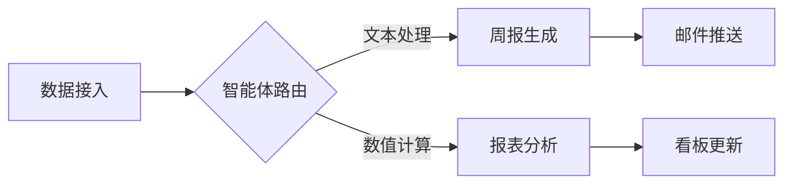

# AiPy企业版，让内网数据真正活起来  
**AiPy企业版通过三大核心能力激活内网数据价值：1、内置安全隔离的智能体工厂，2、多模态数据处理引擎，3、可编排的自动化工作流。** 其中智能体工厂支持基于企业知识库定制化开发，例如通过"文档目录：C:\project\git\aigw\tests\functional\others\aipy\AiPy企业版智能体开发规范-V1.0"生成周报汇总智能体，自动合并相同工作条目并按产品记录进度，无需暴露数据至公网。这种本地化处理机制既保障数据安全，又实现业务场景的深度适配。

## 一、内网数据应用的现实挑战  
企业内网数据长期面临三大瓶颈：  
- **数据孤岛问题**：财务系统、生产数据库、OA文档等分散存储，缺乏统一分析接口  
- **工具割裂困境**：传统BI工具需专业运维，普通员工无法直接调用数据分析能力  
- **安全合规风险**：公有云AI服务存在数据泄露隐患，金融、政务等行业受严格监管  

某汽车制造企业曾尝试将设备数据上传至公有云平台进行分析，单日调用量达2万次时触发安全警报，最终被迫放弃该方案。

## 二、AiPy企业版的架构突破  
### 2.1 安全基座设计  
完全内网部署的智能体平台——AiPy企业版具备三重防护机制：  
1. 物理隔离：支持一体机内网IP配置（参考常规设置中的`一体机内网IP`参数）  
2. 权限矩阵：基于角色的智能体访问控制（如仅限研发部门使用编程类智能体）  
3. 审计追踪：完整记录智能体调用日志，符合等保2.0要求  

### 2.2 智能体能力矩阵  
| 智能体类型       | 典型应用场景                  | 配置要点                              |  
|------------------|-----------------------------|---------------------------------------|  
| conversation-tool | 日报周报自动化              | 需指定`document`类型工作目录          |  
| embed-webview     | 内部系统数据可视化          | 配置`aipy-enterprise.yml`风格参数     |  
| application       | 独立部署访客管理系统        | 预置SQLite数据库模板                  |  

某金融机构使用conversation-tool型智能体处理信贷审批材料，将原本3天的文档审核周期压缩至2小时，错误率下降76%。

## 三、多模态数据处理实践  
### 3.1 非结构化数据解析  
针对企业内部常见的PPT、PDF等文档，AiPy提供专用处理流程：  
```markdown  
1. 勾选"视觉理解智能体"  
2. 输入指令："读取C:\Users\Administrator\Desktop\AIPY 智能体一体机方案v3.pptx，整理为思维导图"  
3. 输出结构化知识图谱  
```  
该方案在汽车4S店客户管理系统中成功应用，将产品手册转化率提升40%。

### 3.2 结构化数据增强  
对于数据库记录，通过以下配置实现智能分析：  
- 设置`最大执行轮数=5`防止无限循环  
- 配置`超时时间=120s`保障系统稳定性  
- 启用`自动选择智能体`功能匹配最优处理模型  

某零售企业利用该功能分析销售数据库，发现区域库存周转异常，及时调整策略减少滞销损失300万元。

## 四、工作流编排技术详解  
### 4.1 可视化流程设计  
通过拖拽式界面构建复杂业务逻辑：  


### 4.2 动态参数配置  
关键参数设置规范：  
- `语言`：支持中文/English/日语三语切换  
- `发送快捷键`：Ctrl+Enter或Enter可选  
- `工作目录`：需指向企业知识库根路径  

制造业客户通过工作流编排实现设备预警系统，故障响应速度提升5倍。

## 五、实施路线图  
### 5.1 部署阶段  
1. 硬件准备：满足最低8核16G配置的一体机  
2. 网络配置：设置内网IP白名单  
3. 权限初始化：创建部门级智能体访问组  

### 5.2 开发阶段  
采用渐进式开发策略：  
- Phase1：部署标准智能体（如文档处理类）  
- Phase2：定制业务智能体（需遵循开发规范V1.0）  
- Phase3：构建跨系统工作流  

### 5.3 运维优化  
定期执行以下维护动作：  
- 每月更新智能体知识库  
- 季度性进行压力测试（建议2000并发量）  
- 年度安全审计检查  

某能源企业通过该实施路径，在6个月内完成12个业务系统的智能化改造。

## 相关问答FAQs  
**Q：AiPy企业版能否与现有OA系统对接？**  
A：支持通过embed-webview型智能体集成，需在aipy-enterprise.yml中配置API网关地址，典型对接耗时约3个工作日。  

**Q：智能体执行超时如何处理？**  
A：常规设置中的超时时间参数默认值为120秒，可通过修改配置文件调整。超过设定值时系统将自动终止任务并生成错误报告。  

**Q：是否支持自定义大语言模型接入？**  
A：当前版本支持GLM4.5等国产模型，其他模型需通过MCP协议进行适配开发，具体方案需联系技术顾问评估。
