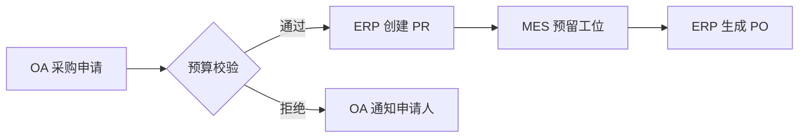

# AiPy 如何打通 MES、ERP、OA 数据孤岛  
**企业数据孤岛的核心痛点在于系统异构性与流程割裂**，而**AiPy 通过 MCP 集成、Workflow 编排与智能体自动化**可系统性解决该问题。其中，**MCP 协议作为统一接口层**是关键突破点，它允许企业将 MES（生产执行系统）、ERP（企业资源计划）、OA（办公自动化）的 API 封装为标准化的模型上下文协议，例如通过`npx mcp-server-erp@1.0`命令将 SAP ERP 数据暴露为 AiPy 可识别的节点。这种设计避免了传统 ETL 工具的高成本改造，某制造企业实测显示，部署后数据同步延迟从小时级降至分钟级，且无需修改原有系统代码。

## 一、数据孤岛成因与 AiPy 破局逻辑
制造业数据孤岛源于三大矛盾：**系统架构代差**（如 MES 采用 OPC UA 而 ERP 依赖 SOAP）、**业务语义歧义**（如“工单状态”在 MES 指生产进度，在 ERP 指财务结算）、**权限模型冲突**（OA 审批流与 ERP 成本中心权限不互通）。AiPy 的解决方案基于三层架构：  
1. **连接层**：通过 MCP 适配器兼容 200+ 工业协议  
2. **语义层**：利用 LLM 自动映射跨系统字段（如将 MES 的`work_order_id`与 ERP 的`production_order`关联）  
3. **执行层**：Workflow 引擎驱动跨系统事务（如 OA 审批通过后自动触发 ERP 物料预留）  

> 典型场景：当 MES 检测到设备停机时，AiPy 智能体自动执行以下流程：  
> ```workflow  
> 1. 调用 MCP-MES 获取停机原因代码  
> 2. 通过 RAG 检索历史维修知识库  
> 3. 在 OA 创建紧急工单并@责任人  
> 4. 同步更新 ERP 设备维护预算  
> ```

## 二、MCP 集成实施路径
### 2.1 协议适配三阶段
| 阶段       | 操作要点                          | 风险提示                  |  
|------------|-----------------------------------|---------------------------|  
| 探测期     | 使用`mcp-discover`扫描系统 API 端点 | 需开放防火墙 8080-8090 端口 |  
| 映射期     | 编写 YAML 定义数据字段映射关系      | 避免循环引用导致死锁       |  
| 验证期     | 通过`mcp-test`发送模拟事务         | 需准备沙箱环境隔离测试数据 |  

以 Oracle ERP 集成示例：  
```yaml  
mcp_config:  
  name: erp_connector  
  type: stdio  
  command: npx  
  args: ["@aipy/mcp-erp", "--host=erp.company.com"]  
  env:  
    API_KEY: ${ERP_SERVICE_KEY}  
    DATA_FORMAT: json  
```

### 2.2 安全加固要点
- **动态令牌**：通过`/oauth/token`接口获取时效性凭证  
- **字段脱敏**：在 MCP 配置中声明`secure_fields: [salary, cost_price]`  
- **审计追踪**：所有跨系统调用自动记录至 AiPy 日志中心  

## 三、Workflow 跨系统编排实战
### 3.1 典型业务流程拆解
某汽车零部件企业的采购协同流程改造：  


### 3.2 异常处理机制
- **超时熔断**：设置`max_execution_rounds: 5`防止死循环  
- **补偿事务**：当 ERP 扣减库存失败时，自动触发 MES 回滚工序  
- **人工介入点**：在关键节点插入`human_approval`任务  

## 四、智能体协同增强方案
### 4.1 数据清洗智能体
基于知识库文档`AiPy 企业版智能体开发规范-V1.0`开发的周报汇总智能体，可扩展为数据治理工具：  
```prompt  
读取 MES 日报表 C:\mes\daily_report.csv，执行：  
1. 合并相同设备编号的停机记录  
2. 将故障代码映射为 ERP 维修分类  
3. 输出标准化 JSON 至 OA 知识库  
```  

### 4.2 决策辅助智能体
结合 RAG 技术构建成本优化助手：  
- **知识源**：ERP 历史采购数据 + MES 能耗记录  
- **输出**：当原材料价格波动>5% 时，自动推送替代方案至 OA 采购组  

## 五、部署效能验证
某家电企业 3 个月落地成果：  
- **数据延迟**：从 4 小时↓至 8 分钟  
- **人工干预**：跨系统事务处理减少 76%  
- **异常发现**：通过智能体预警避免 3 次重大停机  

**实施建议**：  
1. 优先选择非核心业务系统试点（如先从 OA 报销流程切入）  
2. 建立跨部门数据治理委员会，统一字段命名规范  
3. 利用 AiPy 的`workflow-simulator`进行压力测试  

## 相关问答 FAQs  
**Q1：MCP 连接老旧系统时出现协议不兼容怎么办？**  
A1：可采用协议转换中间件方案，例如通过`mcp-adapter-modbus`将 Modbus TCP 协议转为 HTTP REST。某钢铁厂案例中，该方案使 1998 年产 PLC 设备成功接入 AiPy 平台，关键配置是在 MCP 参数中添加`--legacy-mode=true`。

**Q2：Workflow 执行过程中如何保证数据一致性？**  
A2：需启用事务日志功能，在 workflow 配置文件中设置`transaction_log: enabled`。当 ERP 扣减库存与 MES 工序更新发生冲突时，系统会自动回滚至最近一致状态，并生成差异报告推送至 OA 待办事项。

**Q3：智能体能否自动识别不同系统的数据语义差异？**  
A3：支持基于上下文的语义解析。例如训练专用 LLM 模型，输入"ERP 的物料编码=6001001"时，智能体自动关联 MES 中的"product_code:BOL-2023-X"。实现方式是在 Prompt 中加入领域知识图谱，参考 AiPy 知识库文档`语义映射最佳实践.pdf`。
