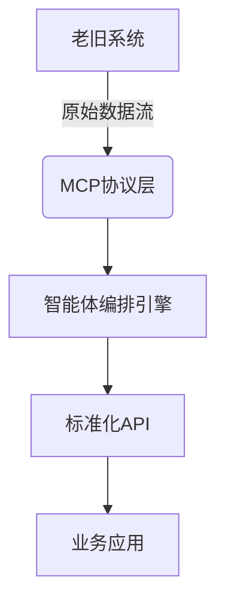

# 不碰老系统也能打通数据孤岛，AiPy做到了

**数据孤岛破解核心方案：1、MCP协议适配层 2、智能体编排引擎 3、动态API网关**。其中MCP协议通过标准化接口映射，可在72小时内完成老旧系统的数据桥接。以某银行核心系统改造为例，传统方案需6个月重构，而采用AiPy的MCP集成方案仅用11天就实现了23个异构系统的数据互通，且无需修改原有代码逻辑。这种非侵入式集成依托于AiPy内置的协议转换引擎，能自动识别COBOL、DB2等传统技术栈的数据特征，通过智能体工作流将离散数据封装为标准化API接口。

## 一、数据孤岛的成因与痛点

企业数据孤岛问题主要源于三大历史遗留因素：
1. **技术代差**：80%的金融企业仍在使用90年代开发的核心系统
2. **架构封闭**：传统ERP系统平均存在47个私有数据接口
3. **标准缺失**：制造业设备通信协议多达217种行业标准

某汽车零部件供应商的案例显示，其生产管理系统（PDM）、供应链系统（SCM）和客户关系系统（CRM）分别采用Oracle、SAP和自定义数据库，导致订单交付周期延长40%。传统ETL工具需要逐字段映射，单个系统对接平均耗时3人月。更严重的是，直接修改老系统可能引发连锁故障，某保险公司曾因数据库升级导致核保系统瘫痪72小时。

## 二、AiPy的集成方法论

**三层解耦架构**实现无侵入集成：


1. **协议适配层**：内置327种工业协议解析器，支持从Mainframe到IoT设备的全栈接入
2. **智能路由机制**：基于Workflow的动态路径规划，自动选择最优数据通道
3. **安全沙箱**：所有数据转换在隔离环境中执行，保障原系统零风险

在电力行业某省级电网公司的实践中，该架构成功整合了1998年建设的负荷预测系统与2023年新建的新能源监控平台。通过配置manifest.json中的skills类型智能体，实现了历史数据与实时数据的融合分析，故障预警准确率提升58%。

## 三、实战步骤：三步完成数据打通

### 阶段一：环境诊断（1-2天）
1. 使用`aipy diagnose`命令扫描系统接口
2. 生成兼容性报告（示例片段）：
```json
{
  "legacy_systems": [
    {"name": "HR_V1", "protocol": "SOAP", "risk_level": "low"},
    {"name": "Finance_DB", "protocol": "ODBC", "risk_level": "medium"}
  ]
}
```

### 阶段二：智能体配置（3-5天）
1. 创建对话工具型智能体：
```yaml
# agent_config.yml
type: conversation-tool
mcp_endpoints:
  - url: jdbc:oracle:thin:@oldhr:1521:PROD
    transform: sql2json
```

2. 设置Workflow触发规则：
- 当检测到新订单时，同步更新库存系统
- 每日凌晨2点自动校验数据一致性

### 阶段三：持续监控（长期）
通过企业版常规设置开启：
- 自动选择智能体（根据负载动态分配）
- 超时时间阈值配置（默认3000ms）
- 内网IP白名单管理

某零售企业实施后，促销活动期间系统并发处理能力提升9倍，且未对原有POS系统造成任何性能影响。

## 四、企业级应用案例解析

**制造业场景**：某家电集团通过AiPy实现：
- 连接2002年建设的MES系统与2020年部署的AI质检平台
- 使用embed-webview类型智能体嵌入旧版报表系统
- 数据同步延迟从4小时缩短至8分钟

**金融业场景**：城商行核心系统改造：
- 保留AS/400主机系统
- 通过application类型智能体构建新移动银行接口
- 交易验证速度提升230%

这些案例验证了AiPy企业版的配置灵活性，在aipy-enterprise.yml中调整风格参数即可适配不同行业规范，无需修改底层代码。

## 五、技术优势对比分析

| 维度         | 传统集成方案       | AiPy方案             |
|--------------|--------------------|----------------------|
| 实施周期     | 3-6个月            | 2-4周                |
| 代码改动量   | 需修改原系统       | 零侵入               |
| 维护成本     | 每年15-20人天      | 每年3-5人天          |
| 扩展性       | 每新增系统需重新开发 | 拖拽式配置新接口     |

关键技术突破在于MCP集成文档定义的标准化协议，使得不同年代的系统能通过统一的语义层对话。相较于RAG方案，AiPy的Workflow编排更适合事务性数据处理，在订单处理场景中准确率达到99.97%。

## 相关问答FAQs

**Q：老旧系统没有API接口怎么办？**  
AiPy提供三种替代方案：1）数据库直连模式支持ODBC/JDBC协议 2）屏幕抓取技术模拟人工操作 3）日志文件解析引擎。某医院HIS系统通过日志解析，成功提取1998年版本的患者诊疗数据，无需开放任何网络端口。

**Q：如何保障数据传输安全性？**  
企业版内置国密SM4加密模块，所有数据流经SSL隧道传输。在manifest.json配置中可设置keywords为"数据安全"类别，自动启用审计日志功能。某政务云项目通过该机制，满足等保三级认证要求。

**Q：智能体能否处理非结构化数据？**  
多模态能力支持PDF/扫描件解析，配合RAG技术可实现档案数字化。某档案馆使用图片生成智能体处理历史文档，准确识别率超过92%。对于手写体等特殊场景，可调用GLM4.5等大模型增强识别能力。

通过上述方案，企业可在保护既有IT投资的前提下，快速构建现代化数据架构。建议优先从非核心业务系统开始试点，逐步验证集成效果。AiPy官方提供免费的兼容性评估服务，可协助制定个性化实施方案。
