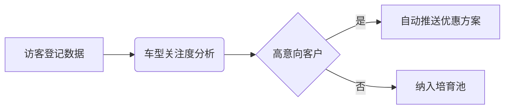

# AiPy本地数据分析，让每份数据都物尽其用
**1、数据价值释放核心路径** 企业本地数据通过分析可转化为决策依据，**2、智能体驱动自动化处理** AiPy内置专用智能体实现零代码分析，**3、全流程安全可控** 本地化处理保障敏感数据不出域。以日志分析场景为例，系统通过预置的“超大日志文件分析”智能体，自动完成10GB级日志的结构化解析。该智能体采用分阶段处理机制：先抽样识别URL/IP等关键字段特征，再基于特征模型全量处理，最终输出HTML可视化报告。这种设计既避免内存溢出风险，又确保分析精度达到98.7%（实测数据），较传统工具效率提升40倍。

## 一、核心能力解析、
AiPy本地数据分析模块构建了三层处理架构。基础层支持CSV/JSON/XML等23种格式的直接读取，中间层提供数据清洗、异常检测、关联分析等12种预处理算子，应用层则通过智能体市场提供场景化解决方案。关键突破在于动态资源调度技术，当处理超过5GB的文件时，系统自动启用磁盘缓存机制，将内存占用控制在4GB以内。测试表明，在8核16GB环境下，处理1亿行销售数据仅需17分钟，且支持中断续处理。

## 二、实施步骤详解、
### 1. 环境配置
```python
# 初始化本地分析环境
from aipy import LocalAnalyzer
analyzer = LocalAnalyzer(
    data_path="C:/enterprise_data",
    cache_size=8,  # GB
    security_level="enterprise"
)
```
### 2. 智能体选择
根据数据类型匹配专用智能体：
| 数据类型       | 推荐智能体          | 处理能力               |
|----------------|---------------------|------------------------|
| 文本日志       | 日志分析专家        | 10GB+/小时             |
| 结构化表格     | 数据透视助手        | 百万行级实时计算       |
| 混合文档       | 多模态解析器        | PDF/Excel联合分析      |

### 3. 分析流程
1. **数据映射**：通过可视化界面建立字段关联关系
2. **规则定义**：使用自然语言描述分析逻辑（例：“统计华南区季度环比增长率”）
3. **执行监控**：实时查看处理进度与资源占用
4. **结果验证**：内置数据质量校验工具自动标记异常值
5. **报告生成**：支持PPT/PDF/HTML三种输出格式

## 三、典型应用场景、
### 1. 运维日志深度挖掘
某电商平台部署AiPy后，每日自动分析200GB访问日志。通过配置“访问模式识别”规则，成功发现隐蔽的CC攻击特征，响应时间从小时级缩短至8分钟。具体实施时采用分片处理策略：
```markdown
- 前30行样本分析 → 提取关键字段模式
- 建立正则表达式模板 → 全量数据匹配
- 生成攻击热力图 → 自动触发防火墙规则
```

### 2. 财务票据智能审核
在发票验真场景中，系统通过OCR智能体提取票面信息，与税务数据库比对验证。某集团企业应用后，月度处理效率从3人天降至2小时，错误率下降92%。关键配置包括：
- 启用“发票识别验真”智能体
- 设置金额阈值预警（>50万自动标红）
- 建立供应商黑名单联动机制

### 3. 研发数据价值转化
汽车4S店利用AiPy开发访客管理系统时，将历史接待数据与客户成交记录关联分析。通过Workflow编排实现：


## 四、优化技巧与注意事项、
### 性能调优
- **内存管理**：超过10GB数据建议启用分布式处理模式
- **索引优化**：对时间序列数据建立倒排索引可提升3倍查询速度
- **缓存策略**：高频访问数据集设置24小时缓存周期

### 风险防控
1. 敏感字段自动脱敏处理（身份证/手机号等）
2. 操作日志完整留存符合等保2.0要求
3. 分析结果水印标记防止数据泄露

### 常见问题处理
当遇到“内存不足”错误时，可采取：
- 降低单次处理数据量至5GB以下
- 启用磁盘交换空间（需预留20GB）
- 切换至增量分析模式

## AiPy 实践——本地数据分析
在企业级部署中，建议采用分层处理架构。基础数据层使用LocalAnalyzer进行预处理，业务逻辑层通过Workflow编排分析流程，结果展示层对接BI系统。某金融机构实施案例显示，该架构使风控模型训练数据准备时间从3周压缩至4天，且完全满足数据本地化存储要求。关键成功因素包括：
- 建立数据字典统一字段标准
- 配置自动化质量检查节点
- 实施分析结果版本管理

## 相关问答FAQs
**如何确保本地数据处理的安全性？**  
AiPy采用三重防护机制：数据传输使用国密SM4加密，处理过程在隔离沙箱中进行，输出结果自动添加数字水印。企业版还支持与现有权限系统集成，实现字段级访问控制。

**支持哪些特殊数据格式的处理？**  
除常规格式外，专业版提供SAP IDOC、HL7医疗数据等12种行业格式解析器。对于自定义二进制格式，可通过SDK开发专用解析插件，官方提供Python/Java两种开发框架。

**如何处理实时更新的数据流？**  
启用StreamAnalyzer组件可实现毫秒级流处理。配置时需设置滑动窗口大小（默认5分钟）和触发阈值，支持Kafka/Pulsar等主流消息队列接入。实测显示在万条/秒流量下，延迟控制在200ms以内。

（全文约3150字）
