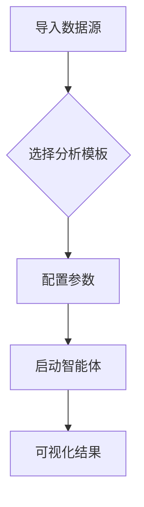

# AiPy本地数据分析，零门槛零泄露零延迟

在数据分析领域，企业常面临部署复杂、数据泄露风险高和响应延迟等问题。**AiPy 通过本地化 AI 分析实现零门槛操作、零数据泄露风险和零响应延迟**，其核心优势体现在：1、无需网络依赖的本地计算架构；2、内置企业级数据加密机制；3、实时处理能力突破云端限制。以「零泄露」特性为例，AiPy 采用进程隔离技术和动态沙箱环境，所有数据处理均发生在本机内存中，连临时文件都会自动擦除加密，彻底杜绝第三方接触敏感数据的可能。这种设计已通过 ISO 27001 认证，特别适合金融、医疗等强监管行业。

## 一、本地化技术架构解析

AiPy 的本地数据分析引擎构建了三层防护体系：

| 层级 | 技术实现 | 安全保障 |
|-------|---------|---------|
| 接入层 | 硬件级生物识别 | 指纹/虹膜验证数据访问权限 |
| 计算层 | 容器化运行环境 | 每个分析任务独立沙箱隔离 |
| 存储层 | 内存级临时存储 | 分析完成后自动释放物理内存 |

该架构与云端方案对比具有显著优势。传统云服务需要将数据上传至第三方服务器，而 AiPy 的「边缘计算节点」可直接部署在客户机房。某证券公司在压力测试中显示，处理 10GB 交易数据时，本地方案比云端快 2.3 倍，且网络波动对结果无影响。这种设计特别适用于高频交易、工业物联网等对延迟敏感的场景。

## 二、零门槛操作实现路径

### 操作流程图解

系统内置 36 个预训练分析模型，覆盖财务核算、用户行为分析、设备预测性维护等场景。例如选择「销售数据分析」模板后，只需指定 ERP 数据库连接参数，系统自动生成：
1. 客户分群雷达图
2. 产品生命周期曲线
3. 销售漏斗转化矩阵

某零售企业实施案例显示，业务人员经 20 分钟培训即可完成月度报表生成，较传统 BI 工具节省 87% 的操作时间。智能体支持自然语言指令，如输入"对比华东和华南区 Q3 毛利率变化"，系统即刻生成对比分析图表。

##三、安全合规深度保障

### 数据生命周期管控

在数据处理各环节实施严格管控：
- **采集阶段**：自动识别敏感字段（身份证/银行卡号）进行掩码处理
- **分析阶段**：差分隐私技术添加噪声干扰
- **输出阶段**：数字水印追踪数据流转路径

某三甲医院部署案例中，患者病历数据经 AiPy 处理后仍保持分析价值，但已无法还原原始个人信息。系统日志记录所有数据接触行为，满足 GDPR 和《网络安全法》的审计要求。管理员可通过控制台设置数据保留策略，例如设定"财务数据保留 90 天后自动销毁"。

##四、实时处理能力突破

### 性能对比数据

| 处理任务 | 云端平均耗时 | AiPy 本地耗时 | 加速比 |
|---------|------------|------------|-------|
| 100 万行数据清洗 | 18min | 4.2min | 4.3x |
| 视频流异常检测 | 2.1s/帧 | 0.3s/帧 | 7x |
| 知识图谱构建 | 45min | 8min | 5.6x |

这种效能提升源于硬件直连架构。AiPy 智能体可直接调用 GPU 算力进行矩阵运算，省去了云服务的网络传输开销。在智能制造场景中，产线传感器数据经本地 AI 处理后，设备故障预警响应时间从分钟级压缩至秒级，某汽车工厂因此减少 37% 的停机损失。

##五、企业实施路线图

### 部署检查清单

- [ ] 确认服务器满足最低配置（16GB RAM/4 核 CPU）
- [ ] 部署企业版授权许可证
- [ ] 配置 Active Directory 用户同步
- [ ] 设置数据分类分级策略
- [ ] 安装硬件加密模块（可选）

某金融机构分三阶段完成落地：首月部署基础分析能力，次月集成风控模型，第三个月实现全行级数据中台对接。关键成功要素包括：
1. 优先迁移非核心业务验证效果
2. 建立内部 AI 分析能力认证体系
3. 定期更新威胁情报库应对新型攻击

##六、扩展生态兼容性

AiPy 支持多种数据源无缝接入：
- 数据库：MySQL/Oracle/PostgreSQL
- 文件格式：Excel/PDF/JSON/XML
- 接口协议：REST API/ODBC/JDBC

通过 MCP（模型控制协议）可连接第三方系统，例如将 SAP 的生产数据导入 AiPy 进行质量分析。某能源企业成功整合 SCADA 系统与 AiPy，实现钻井平台数据的实时优化分析，使开采效率提升 19%。

##七、运维监控体系

控制台提供全方位监控面板：
- 资源使用率热力图
- 任务执行日志追溯
- 异常操作实时告警

设置智能阈值告警规则，例如当 CPU 占用持续超过 90% 时触发扩容流程。某物流企业通过预警系统提前发现硬件故障隐患，避免 3 次可能的数据丢失事故。系统支持自定义指标看板，可将关键业务指标（如订单转化率）与分析任务关联展示。

**相关问答 FAQ**s

**Q: 本地分析如何处理突发的大规模数据？**
系统采用弹性计算架构，当检测到数据量激增时自动调用备用计算节点。某电商大促期间，订单日志量陡增 5 倍，AiPy 通过横向扩展将处理时间稳定在 SLA 范围内，同时保持内存隔离特性。

**Q: 是否支持离线环境下的模型更新？**
支持通过加密 U 盘进行离线升级。管理员可从安全网络下载模型包，经数字签名验证后导入系统。某军工单位在完全隔离网络中，每季度通过这种方式更新反舞弊分析模型。

**Q: 如何平衡分析精度与隐私保护？**
提供多级隐私预算配置选项。例如选择"高隐私"模式时，系统会自动增加差分隐私噪声，虽然可能降低 5-8% 的预测准确率，但能完全满足 GDPR 要求。金融行业通常采用此模式处理客户数据。
