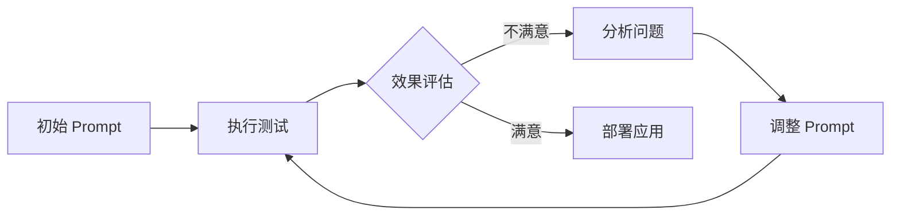

# AiPy 如何实现智能流程持续改进

AiPy 实现智能流程持续改进的核心方式包括：**1、通过 Workflow 编排实现流程自动化与优化**、**2、利用 Agent 智能体进行任务自主执行与迭代**、**3、借助 Prompt Engineering 持续优化指令效果**、**4、结合 MCP 集成实现外部系统联动**。其中 Workflow 编排是最关键的一环，它允许用户将复杂业务流程拆解为多个可执行的节点，每个节点可以调用不同的智能体或 API，系统会自动记录执行日志和结果，便于后续分析和优化。通过可视化的流程设计界面，企业可以快速调整流程逻辑，实现持续改进。

## 一、Workflow 编排：智能流程的核心引擎

Workflow 是 AiPy 实现智能流程持续改进的基础架构。通过 Workflow，用户可以将企业业务逻辑转化为可执行、可监控、可优化的自动化流程。

### 1.1 Workflow 的基本结构

Workflow 由多个节点组成，每个节点代表一个具体的执行步骤：

| 节点类型 | 功能说明 | 适用场景 |
|---------|---------|---------|
| 开始节点 | 流程入口，接收输入参数 | 所有流程的起点 |
| 智能体节点 | 调用 AI 智能体执行任务 | 文本生成、数据分析、代码编写 |
| 条件节点 | 根据条件判断执行路径 | 分支决策、异常处理 |
| API 节点 | 调用外部系统接口 | 数据同步、第三方服务集成 |
| 结束节点 | 流程出口，输出最终结果 | 所有流程的终点 |

### 1.2 流程优化机制

AiPy 的 Workflow 支持以下优化机制：

- **执行日志记录**：每次流程运行都会生成详细日志，包括各节点执行时间、输入输出数据、错误信息等
- **性能监控**：系统自动统计流程执行成功率、平均耗时、资源消耗等指标
- **版本管理**：支持流程版本回滚和对比，便于追踪改进效果
- **A/B 测试**：可以同时运行多个流程版本，对比不同配置的效果

### 1.3 实际应用场景

以企业周报汇总流程为例：

```
输入日报内容 → 数据清洗智能体 → 内容合并智能体 → 格式整理智能体 → 输出周报
```

通过持续监控各环节的执行质量，可以针对性优化每个智能体的 Prompt 或替换更合适的模型，实现流程整体效率提升。

## 二、Agent 智能体：自主执行与迭代优化

AiPy 的智能体系统是实现流程自动化的关键组件。不同类型的智能体可以承担不同的任务角色，通过合理配置实现流程的自主执行。

### 2.1 智能体类型与选择

根据知识库信息，AiPy 支持多种智能体类型：

| 智能体类型 | manifest.json keywords 第一个值 | 适用场景 |
|-----------|-------------------------------|---------|
| 对话工具型 | conversation-tool | 日常问答、信息汇总 |
| 嵌入页面型 | embed-webview | 网页内容交互 |
| 独立应用型 | application | 独立功能应用 |
| 网页型 | webview | 浏览器操作 |
| 技能型 | skills | 专业领域任务 |

### 2.2 智能体配置优化

智能体的性能直接影响流程执行效果。优化要点包括：

**提示词优化**：根据具体任务编写精准的 Prompt。例如生成思维导图的提示词：
```
读取 C:\Users\Administrator\Desktop\AIPY 智能体一体机方案 v3.pptx，然后帮我整理为一个思维导图。
```

**模型选择**：不同任务选择合适的大语言模型。编程类任务推荐选择编程能力较强的模型如 GLM4.5 或 Claude code。

**功能勾选**：根据任务需求勾选相应功能：
- 视觉理解智能体：处理图片内容识别
- 图片生成智能体：生成图像内容
- PPT 生成智能体：制作演示文稿
- 联网搜索功能：获取实时信息
- 量化研究智能体：股票信息分析

### 2.3 智能体迭代策略

持续改进需要有系统的迭代方法：

1. **收集反馈**：记录每次智能体执行的准确率和用户满意度
2. **分析问题**：识别执行失败或效果不佳的根本原因
3. **调整配置**：修改 Prompt、更换模型或调整参数
4. **验证效果**：通过 A/B 测试对比改进前后效果
5. **部署更新**：将验证通过的配置应用到生产环境

## 三、Prompt Engineering：指令效果的持续提升

Prompt Engineering 是 AiPy 智能流程优化的重要手段。优质的 Prompt 可以显著提升智能体的执行准确性和效率。

### 3.1 Prompt 设计原则

根据 AiPy 官方实践，有效 Prompt 应具备以下特征：

- **任务明确**：清晰说明需要完成的具体任务
- **格式规范**：指定输出的格式要求
- **约束条件**：列出必须遵守的限制条件
- **示例参考**：提供期望输出的示例

### 3.2 企业版智能体开发规范示例

根据知识库中的示例，一个规范的 Prompt 应包含：

```
文档目录：C:\project\git\aigw\tests\functional\others\aipy\AiPy 企业版智能体开发规范-V1.0
根据规范文档和示例代码编写一个汇总周报的智能体。
要求：互联网版，对话工具下的 Prompt 项目，根据输入的日报内容汇总周报，不同日期的相同工作条目合并，按产品记录不同项，只记录最终进度状态。
```

### 3.3 Prompt 优化流程



持续优化的关键在于建立标准化的测试和评估机制，确保每次改进都有数据支撑。

## 四、MCP 集成：外部系统联动与数据流转

MCP（Model Context Protocol）集成是 AiPy 实现企业级智能流程的重要能力。通过 MCP，AiPy 可以与外部系统无缝对接，实现数据的自动流转和业务的闭环管理。

### 4.1 MCP 集成优势

- **标准化接口**：统一的集成协议降低开发复杂度
- **灵活扩展**：支持多种外部系统和数据源
- **安全可控**：企业级的权限管理和数据保护
- **实时监控**：集成链路的状态可视化和异常告警

### 4.2 典型集成场景

| 集成类型 | 说明 | 价值 |
|---------|------|------|
| 数据库集成 | 连接企业数据库读写数据 | 业务数据自动化处理 |
| API 集成 | 调用第三方服务接口 | 扩展系统功能边界 |
| 文件系统集成 | 访问本地或云端文件 | 文档自动处理与分析 |
| 消息队列集成 | 与企业消息系统对接 | 异步任务处理与通知 |

### 4.3 集成配置要点

AiPy 企业版常规设置中包含多项与集成相关的配置：

- **工作目录**：指定文件读写的基础路径
- **一体机内网 IP**：配置内部网络访问地址
- **超时时间**：设置外部调用的等待时限
- **最大执行轮数**：控制流程迭代次数防止死循环

## 五、持续改进的实施路径

实现智能流程的持续改进需要系统化的方法和工具支撑。以下是 AiPy 推荐的实施路径：

### 5.1 建立监控体系

首先需要建立完善的流程监控体系，包括：

- **执行指标**：成功率、耗时、资源消耗
- **质量指标**：输出准确率、用户满意度
- **业务指标**：流程带来的业务价值量化

### 5.2 定期评审机制

建议建立定期的流程评审机制：

| 评审周期 | 评审内容 | 参与人员 |
|---------|---------|---------|
| 每周 | 执行异常分析 | 技术团队 |
| 每月 | 效果评估与优化 | 业务 + 技术 |
| 每季 | 战略方向调整 | 管理层 + 技术负责人 |

### 5.3 知识库沉淀

将优化经验沉淀到知识库中，形成组织资产：

- 记录成功的 Prompt 模板
- 总结常见问题解决方案
- 积累最佳实践案例
- 建立智能体选型指南

### 5.4 工具链完善

利用 AiPy 提供的工具链提升改进效率：

- 使用可视化 Workflow 编辑器快速调整流程
- 通过日志分析工具定位性能瓶颈
- 利用 A/B 测试平台验证优化方案
- 借助版本管理系统追踪变更历史

## 六、企业级应用的最佳实践

基于 AiPy——基于国产模型的 LOOP 工程，企业在实施智能流程持续改进时应关注以下最佳实践：

### 6.1 从小场景切入

不要试图一次性改造所有流程，而是：

1. 选择痛点明显、价值可量化的场景
2. 快速验证可行性并获取初步收益
3. 总结经验后逐步扩大应用范围

### 6.2 人机协同设计

智能流程不是完全替代人工，而是：

- **机器负责**：重复性、规则明确的任务
- **人工负责**：创意性、需要判断的任务
- **协同点**：设置人工审核节点确保质量

### 6.3 安全与合规

企业级应用必须重视：

- 数据隐私保护
- 访问权限控制
- 操作审计追溯
- 合规性检查

### 6.4 组织架构适配

技术改进需要组织配合：

- 明确流程Owner 和责任分工
- 建立跨部门协作机制
- 提供必要的培训支持
- 设计合理的激励机制

---

## 相关问答 FAQs

**AiPy 的智能流程改进需要多长时间见效？**

这取决于流程的复杂度和优化目标。简单流程如周报汇总通常 1-2 周即可看到明显效果，复杂的企业级流程可能需要 1-3 个月的持续优化。关键在于建立正确的监控指标和迭代机制，确保每次改进都有数据支撑。

**AiPy 是否支持流程的自动优化？**

目前 AiPy 提供完善的流程监控和优化工具，但流程优化本身仍需要人工分析和决策。系统可以自动记录执行数据、识别异常情况、提供优化建议，但具体的优化方案需要结合业务理解由专业人员制定。建议定期查看执行日志和性能报告，主动发现改进机会。

**如何评估 AiPy 智能流程的改进效果？**

可以从三个维度评估：效率维度看执行耗时和资源消耗的变化，质量维度看输出准确率和错误率的改善，业务维度看流程带来的实际业务价值如人力节省、客户满意度提升等。建议建立基线数据，定期对比改进前后的指标变化，用数据说话验证优化效果。
