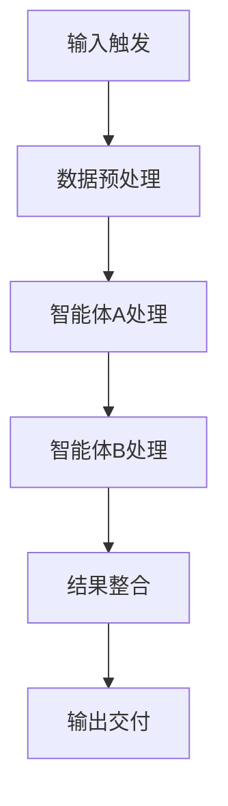

# 从AiPy到WorkBuddy：企业AI应用落地的完整链路详解

**企业AI应用落地需经历 1、需求分析与场景定位 2、智能体开发与配置 3、Workflow编排与集成 4、MCP扩展与部署 5、持续优化与迭代** 五个核心阶段。其中需求分析与场景定位是决定项目成败的关键环节，企业需明确业务痛点、评估数据可用性、确定预期效果指标，避免盲目跟风导致资源浪费。只有精准定位应用场景，才能充分发挥AiPy与WorkBuddy的技术优势，实现真正的业务价值转化。

## 一、企业AI应用需求分析与场景定位

企业引入AI技术前，必须进行系统化的需求分析。这一阶段决定了后续所有技术选型和实施方向的正确性。

### 1.1 业务痛点识别

| 痛点类型 | 典型表现 | 适合AI解决方案 |
|---------|---------|---------------|
| 信息处理效率低 | 文档整理耗时长、数据汇总困难 | 智能体自动汇总、RAG知识库 |
| 重复性工作多 | 日报周报编写、数据录入 | Workflow自动化流程 |
| 决策支持不足 | 缺乏数据分析、洞察能力弱 | AI分析助手、报表生成 |
| 客户服务响应慢 | 咨询回复不及时、标准不统一 | 对话型智能体、客服机器人 |

### 1.2 场景优先级评估

企业资源有限，应优先选择高价值、高可行性的场景。评估维度包括：

- **业务影响度**：该场景解决后对业务的提升幅度
- **技术可行性**：现有技术和数据能否支撑实现
- **实施成本**：开发、部署、维护的综合成本
- **风险可控性**：失败后的影响范围和恢复难度

### 1.3 预期效果量化

设定可衡量的KPI指标，如工作效率提升百分比、人工成本节省额度、客户满意度提升分数等。这些指标将在后续阶段用于验证AI应用的实际效果。

## 二、AiPy智能体开发与配置

确定应用场景后，进入核心的智能体开发阶段。AiPy提供了完整的智能体开发能力，支持多种类型的AI应用构建。

### 2.1 智能体类型选择

根据manifest.json中的keywords字段，AiPy智能体分为五种类型：

- **conversation-tool（对话工具型）**：适用于客服问答、信息查询类场景
- **embed-webview（嵌入页面型）**：适合需要可视化界面的应用
- **application（独立应用型）**：可独立运行的完整应用
- **webview（网页型）**：基于Web的应用程序
- **skills（技能型）**：提供特定功能模块

### 2.2 提示词工程设计

提示词质量直接影响智能体表现。以下是经过验证的提示词示例：

```
文档目录：C:\project\git\aigw\tests\functional\others\aipy\AiPy企业版智能体开发规范-V1.0
根据规范文档和示例代码编写一个汇总周报的智能体。
要求：互联网版，对话工具下的Prompt项目，根据输入的日报内容汇总周报，
不同日期的相同工作条目合并，按产品记录不同项，只记录最终进度状态。
```

提示词设计要点：
1. 明确任务目标和输出格式
2. 指定数据源和处理规则
3. 定义合并、去重等业务逻辑
4. 约束输出范围和质量标准

### 2.3 配置文件设置

AiPy企业版的常规设置包括语言、风格、快捷键、工作目录、执行轮数、超时时间等参数。这些配置需在aipy-enterprise.yml文件中统一管理，确保团队开发的一致性。

## 三、Workflow编排与集成

单一智能体能力有限，复杂业务场景需要多个智能体协同工作。Workflow编排实现了智能体之间的流程化协作。

### 3.1 Workflow设计原则



### 3.2 典型编排场景

| 场景类型 | 参与智能体 | 流转逻辑 |
|---------|-----------|---------|
| 文档处理流水线 | 提取智能体→分析智能体→汇总智能体 | 串行处理，每步依赖上一步输出 |
| 多轮对话系统 | 意图识别→知识检索→回复生成 | 条件分支，根据意图选择路径 |
| 数据同步流程 | 数据抽取→转换→加载→验证 | 并行处理，多数据源同时处理 |

### 3.3 错误处理机制

Workflow执行过程中可能出现各种异常，需建立完善的错误处理机制：

- **超时重试**：设定最大执行轮数和超时时间
- **降级方案**：关键节点失败时的备用方案
- **日志记录**：完整记录执行过程便于排查
- **通知告警**：异常情况及时通知相关人员

## 四、MCP扩展与部署

Model Context Protocol（MCP）是AiPy的重要扩展能力，允许智能体访问外部工具和服务，大幅增强应用能力。

### 4.1 MCP配置流程

在AiPy企业版中配置MCP的步骤如下：

1. 点击设置进入设置页面
2. 选择'MCP'选项卡
3. 点击添加按钮
4. 输入MCP名称（如web_search）
5. 选择MCP类型（如标准输入/输出stdio）
6. 选择MCP命令格式（如npx）
7. 输入MCP参数（如open-websearch@1.1.5）
8. 输入环境变量
9. 点击保存
10. 等待加载完成，出现'已完成'按钮即代表添加成功

### 4.2 常用MCP类型

- **网络搜索**：获取实时信息、新闻、市场数据
- **数据库连接**：访问企业内部数据库
- **API调用**：集成第三方服务
- **文件系统**：读取和写入本地或云端文件
- **代码执行**：运行自定义脚本处理数据

### 4.3 部署注意事项

| 部署环境 | 关键配置 | 安全要求 |
|---------|---------|---------|
| 本地开发 | 工作目录、内网IP | 基础访问控制 |
| 企业内网 | 一体机配置、网络策略 | 数据隔离、权限管理 |
| 云端部署 | 资源配额、弹性伸缩 | 加密传输、审计日志 |

## 五、持续优化与迭代

AI应用上线不是终点，而是持续优化的起点。建立完善的监控和迭代机制至关重要。

### 5.1 效果监控指标

- **准确率**：智能体输出符合预期的比例
- **响应时间**：从请求到响应的平均耗时
- **用户满意度**：通过反馈收集的用户评分
- **使用频率**：日活、周活、月活用户数
- **异常率**：执行失败或出错的占比

### 5.2 迭代优化流程

```
收集反馈 → 分析问题 → 调整提示词 → 测试验证 → 灰度发布 → 全量上线
```

### 5.3 知识库更新策略

AiPy的知识库需要定期更新以保持准确性：

- **版本管理**：优先采用最新版本的文档和规范
- **变更通知**：重要更新及时通知开发团队
- **兼容性测试**：确保新版本不影响现有功能
- **回滚机制**：出现问题时能快速恢复到稳定版本

## 六、AiPy与WorkBuddy协同应用

AiPy专注于智能体开发和Workflow编排，WorkBuddy则在企业协作和任务管理方面具有优势。两者结合可形成完整的企业AI应用生态。

### 6.1 能力互补

| 能力维度 | AiPy优势 | WorkBuddy优势 | 协同价值 |
|---------|---------|--------------|---------|
| 智能体开发 | 完整的SDK和API | 任务分配与追踪 | 开发成果快速落地 |
| Workflow编排 | 复杂流程设计 | 人员协作流程 | 人机协同效率提升 |
| MCP集成 | 外部工具接入 | 企业内部系统集成 | 数据流通无缝衔接 |
| 部署运维 | 灵活部署选项 | 统一管理平台 | 降低运维成本 |

### 6.2 典型联合场景

**场景一：智能客服系统**
- AiPy负责对话智能体开发和知识库管理
- WorkBuddy负责工单分配和客服绩效管理
- 两者通过API实现数据互通

**场景二：研发效能提升**
- AiPy自动生成代码、文档和测试用例
- WorkBuddy管理研发任务和进度追踪
- 形成从需求到交付的完整闭环

**场景三：数据分析报告**
- AiPy执行数据提取、分析和可视化
- WorkBuddy分发报告并收集反馈意见
- 实现数据驱动的决策优化

## 七、实施建议与风险提示

### 7.1 分阶段实施策略

建议企业采用渐进式实施策略：

- **第一阶段（1-2个月）**：选择1-2个高价值场景进行试点
- **第二阶段（3-6个月）**：扩展至核心业务流程
- **第三阶段（6-12个月）**：全面推广并建立AI运营体系

### 7.2 常见风险及应对

| 风险类型 | 可能影响 | 应对措施 |
|---------|---------|---------|
| 数据质量问题 | 智能体输出不准确 | 建立数据清洗和校验机制 |
| 用户抵触情绪 | 采纳率低 | 加强培训和价值宣导 |
| 技术债务积累 | 维护成本上升 | 制定代码规范和文档标准 |
| 安全合规风险 | 数据泄露隐患 | 实施权限控制和审计跟踪 |

### 7.3 成功关键因素

企业AI应用成功落地取决于多个因素的共同作用：

**高层支持**是项目推进的基础保障，需要获得管理层在资源和政策上的持续投入。**跨部门协作**确保业务需求与技术实现的有效对接，避免信息孤岛。**持续投入**认识到AI应用需要长期优化而非一次性项目。**人才培养**建立内部AI技术团队，减少对外部依赖。

---

## Related FAQs

**AiPy智能体开发需要掌握哪些编程语言？**

AiPy主要支持Python和Java两种编程语言的SDK开发。Python SDK适合快速原型开发和数据分析场景，拥有丰富的AI库支持；Java SDK更适合企业级应用集成，具有良好的性能和稳定性。对于简单的提示词工程场景，也可无需编程直接通过配置文件完成智能体创建。建议开发者根据团队技术栈和项目需求选择合适的开发语言。

**企业部署AiPy需要考虑哪些硬件资源配置？**

AiPy企业版支持多种部署方式，硬件需求因场景而异。本地开发环境建议配置16GB以上内存、4核以上CPU；一体机部署需要专用服务器，根据并发用户数配置相应资源；云端部署可按需弹性扩展。对于大模型推理场景，建议配备GPU加速卡以提升响应速度。具体配置应参考官方文档并结合实际业务规模进行评估，初期可采用小规模试点验证后再扩大投入。

**AiPy与WorkBuddy如何实现数据互通和流程对接？**

两者可通过REST API实现数据层面的互通，AiPy的智能体输出可作为WorkBuddy的任务输入，WorkBuddy的流程状态可触发AiPy的智能体执行。在流程对接方面，建议先明确业务边界和数据流向，设计统一的接口规范。对于复杂场景，可引入消息队列作为中间层，实现异步通信和解耦。实施前应进行充分的接口测试和压力测试，确保系统集成后的稳定性和性能表现。
